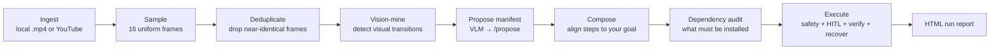

# Mimiq

**Show it a tutorial video. It does the tutorial on your desktop — safely.**

Mimiq ingests a tutorial video (a local `.mp4` or a YouTube URL), mines the on-screen steps with a vision-language model, composes those steps against *your* stated goal, and then carries them out on your real desktop — every action gated by a safety classifier and human approval, verified after it runs, with automatic recovery and an HTML report of the whole session.

It is not a macro recorder and not a screen-scraper. It *watches* a tutorial the way a person would, works out what the steps are, adapts them to what you actually want to build, and executes them under supervision.

> Built for the AMD Hackathon. Windows-first, powered by a vision-language model (Qwen2.5-VL-72B on the AMD endpoint for the demo, Gemini for local dev, with a free-tier fallback).

---

## Why it's built the way it is

Automating a desktop from a video is easy to demo and dangerous to actually run — one wrong click or shell command and you've damaged the user's machine. So Mimiq is designed around *not trusting its own output*:

- Every action is classified **RED / GREEN / YELLOW** before it runs, by a deterministic allow/deny-list classifier (no AI in the safety path).
- Every **RED** (destructive) action is stopped for **human-in-the-loop approval** with an on-screen overlay before it executes.
- Every step is **verified after execution** (screen capture → OCR check against expected success/failure signals), and failures trigger a **recovery** path rather than blindly continuing.
- PyAutoGUI runs with **FAILSAFE on**, so slamming the mouse to a corner aborts everything.

The interesting engineering here isn't "an AI clicks buttons" — it's the guardrails that make letting an AI click buttons survivable.

---

## How it works

The end-to-end pipeline (`main.py`) runs eight stages:



1. **Ingest** — a YouTube URL is downloaded with `yt-dlp`; a local `.mp4` is used directly.
2. **Sample** — 16 uniformly-spaced frames are extracted from the video.
3. **Deduplicate** — near-identical frames are filtered out so the model only reasons over meaningful changes.
4. **Vision-mine** — visual transitions between the surviving frames are detected and written to a candidate audit.
5. **Propose** — the frames and transitions are sent to the vision brain (`/propose`), which proposes a step manifest.
6. **Compose** — `compose_plan` reconciles that manifest with your `--goal`, producing the final phased manifest (and a gap report of anything the video didn't cover).
7. **Dependency audit** — the manifest is scanned for tools/packages that must exist before execution.
8. **Execute → Report** — the orchestrator runs each phase under the safety + HITL + verification + recovery loop, and a full **HTML report** of the run is generated.

---

## Architecture

Mimiq is split into a **local engine** and a **vision brain** that talk over HTTP, so the heavy model calls are isolated from the code that touches your desktop.

| Area | What it does |
|------|--------------|
| `extractor/` | Video ingestion — `downloader` (yt-dlp), `frame_sampler` (uniform frames), `deduplicator` (drop redundant frames) |
| `understander/` | Frame sampling, VLM frame description, and timeline building |
| `generator/` | Thin client that requests step playbooks from the vision brain |
| `orchestrator/` | The execution pipeline — drives steps, runs the safety/HITL/verify/recover loop |
| `executor/` | The hands: PyAutoGUI action runner, safety classifier, HITL overlay, screen capture, OCR verification, recovery, OS adapter, failsafe |
| `cloud_brain.py` | The brain: a FastAPI service wrapping the vision-language model, with provider failover and image compression |
| `utils/` | Vision mining, plan composition, dependency audit, HTML reporter, preflight checks, session/bridge supervision |
| `config.py` | Central config: safety allow/deny lists, ports, provider settings |

### The vision brain (`cloud_brain.py`)

A standalone FastAPI service that all AI calls route through. It exposes `/propose` (video + frames → step manifest), `/playbook` (phase → executable playbook), and `/setup` (workspace bootstrap). It runs a **primary** vision provider (the AMD-hosted Qwen2.5-VL-72B endpoint) with a **Puter free-tier fallback** for local resilience, tracks provider/model failover state, and compresses frames to base64 before sending them to the model. Keeping the model layer in its own process means the desktop-executing code never imports a model SDK directly.

---

## Tech stack

- **Language:** Python
- **Vision-language model:** Qwen2.5-VL-72B (AMD endpoint) · Gemini 2.5 Flash (dev) · Puter fallback
- **Model serving:** FastAPI + Uvicorn (`cloud_brain.py`), OpenAI-compatible client
- **Desktop control:** PyAutoGUI (FAILSAFE on)
- **Vision & capture:** `mss` (screen capture), OpenCV, Pillow, NumPy
- **OCR (verification):** EasyOCR
- **Video:** yt-dlp, ffmpeg-python
- **Robust JSON from models:** `json-repair`

---

## Getting started

> Mimiq drives your real desktop and needs a vision-language model endpoint. Run it in an environment you're comfortable letting it click around in.

**Prerequisites:** Python 3.10+, and a vision-LLM key (Gemini for dev is the easiest start).

```powershell
# 1. Clone
git clone https://github.com/sarthak742/mimiq.git
cd mimiq

# 2. Virtual environment
python -m venv .venv
.\.venv\Scripts\Activate.ps1        # Windows
# source .venv/bin/activate         # macOS/Linux

# 3. Dependencies
python -m pip install -r requirements.txt

# 4. Configure
Copy-Item .env.example .env         # then fill in your keys (see Configuration)
```

Keys live in `.env`, which is git-ignored — never commit real keys.

### Running it

Start the vision brain, then run a pipeline:

```powershell
# The brain (FastAPI, port 8000 by default)
python cloud_brain.py

# CLI — automate a goal from a local video
python main.py --goal "Set up FastAPI JWT auth" --video tutorial.mp4

# CLI — or straight from YouTube
python main.py --goal "Set up FastAPI JWT auth" --url https://youtu.be/...

# Web UI (talks to cloud_brain over the bridge URL)
python ui/app.py
```

Useful flags: `--compose-only` (stop after building the manifest, before touching your desktop — a safe way to see what it *would* do), `--resume` (continue from saved state), `--calibrate` (calibration wizard), `--out-dir` (where outputs go).

---

## Configuration

Set in `.env` (see `.env.example`):

| Variable | Purpose |
|----------|---------|
| `PROVIDER` | `gemini` for local dev, `amd` for the demo endpoint |
| `GOOGLE_API_KEY` / `GEMINI_MODEL` | Gemini dev mode (`gemini-2.5-flash`) |
| `PRIMARY_VISION_URL` / `PRIMARY_VISION_KEY` / `PRIMARY_VISION_MODEL` | Primary AMD-hosted VLM endpoint |
| `PUTER_AUTH_TOKEN` / `PUTER_MODEL` | Free-tier fallback (dev resilience only) |
| `CLOUD_BRAIN_PORT` | Brain service port (default `8000`) |
| `MIMIQ_STEP_GENERATOR_URL` | Bridge URL the web UI uses to reach the brain |

When `PROVIDER=amd`, config fails fast at import time if the primary vision URL is missing or points at a placeholder — so a misconfigured demo can't silently run against the wrong model.

---

## Status & roadmap

Mimiq's core engine — ingestion, vision mining, manifest composition, and the full safety/HITL/verification/recovery execution loop — is built and wired end to end through `main.py`.

Honest about the edges:

- **Windows-first.** Execution is tuned for Windows (DPI-aware, PowerShell setup); an OS adapter exists for cross-platform translation but the demo path targets Windows.
- **Needs a vision endpoint.** No local model — it depends on a hosted VLM (or Gemini for dev).
- **Test coverage is early.** The engine is functional; automated tests are still thin.
- **Live transcript/doc-search are stretch.** The solid path is local `.mp4` (and now YouTube) → compose → execute → report; deeper transcript and documentation-search features are follow-on work.

---

## Project structure

```
mimiq/
├── main.py            # CLI entry — the end-to-end pipeline
├── cloud_brain.py     # Vision brain (FastAPI VLM service)
├── config.py          # Config: safety lists, ports, providers
├── extractor/         # Ingest: download, sample, deduplicate frames
├── understander/      # Frame sampling, VLM description, timeline building
├── generator/         # Client to the vision brain
├── orchestrator/      # Execution pipeline
├── executor/          # Desktop actions, safety, HITL, verify, recover
├── ui/                # Web UI
├── utils/             # Vision mining, composer, dep audit, reporter, preflight
├── tests/
├── requirements.txt
└── .env.example
```
